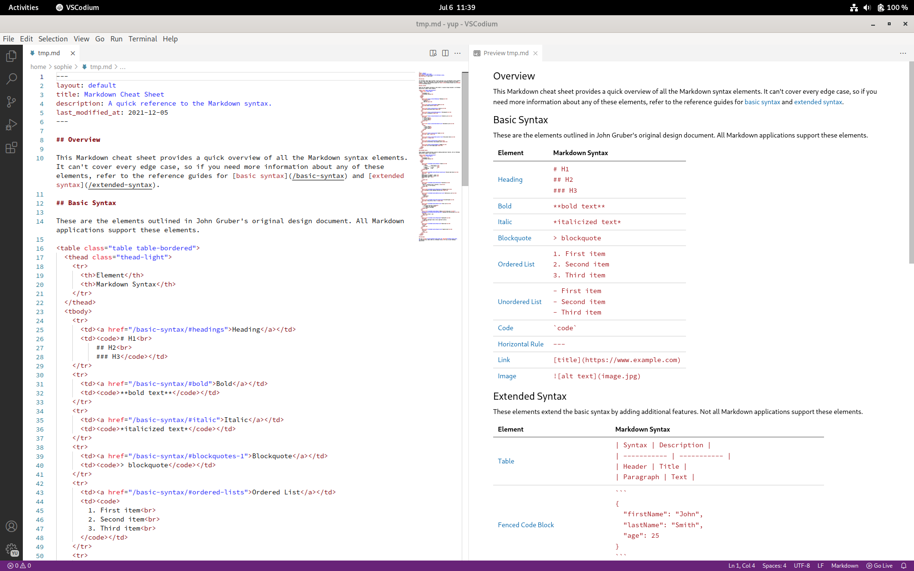

<!--
author:   Sophie Matter

version:  0.1.0
language: en
narrator: US English Female

date:     2024-04-18

logo:     https://raw.githubusercontent.com/TIBHannover/oer-github-tutorial-liascript/main/img/preview.png

tags:     OER, Git, GitHub, Tutorial, LiaScript

comment:  This tutorial shows how to easily publish OER on GitHub using LiaScript.
          By following just a few simple steps, you can create your own OER, publish it
          for free on GitHub and include it in our OER search index OERSI in under
          five minutes!

@attribute

Technische Informationsbibliothek (TIB) - Leibniz-Informationszentrum
Technik und Naturwissenschaften - Universitätsbibliothek

License: <a target="_blank" href="https://creativecommons.org/licenses/by/4.0/deed.de">CC BY 4.0 DEED</a>

@end

@style
section {
  margin-top: 1em;
  margin-bottom: 1em;
}
@end

-->

# Create and publish OER on GitHub using LiaScript

We believe that open educational resources can be created using tools the open source community has been successfully using for many years now.
This tutorial guides you through the creation of open educational resources (OER) with GitHub.
Using our GitHub template, you can easily create and publish your own OER in just a few minutes.

> This is only a technical instruction.
> Please make sure to check and regard legal regulations of your country, i.e. if and how you need to provide an imprint.

<section>

## What's in this tutorial:

* [Quick Start](#quick-start)
* [Step-by-step](#requirements)
* [Reference](#reference)
* [Troubleshooting](#troubleshooting)
* [FAQ](#faq)

</section>

<section>

## Possible formats for your OER

This tutorial focuses on our template.
However, you could also use other formats.

</section>

<section>

## LiaScript

LiaScript is what this tutorial is made with.
All it takes for your OER to be displayed with LiaScript is a Markdown file hosted anywhere and is the quickest and easiest way to your first OER.

[Go to LiaScript](https://liascript.github.io)

</section>

<section>

## Markdown documents template

 
 

Our Markdown documents template template allows you to quickly host your OER on GitHub Pages with just a few steps.
A web page as well as different formats like PDF and epub are generated automatically with each change to your OER.

You can see this tutorial made with our template here: [Template OER Tutorial](https://tibhannover.github.io/oer-github-tutorial-template/)

[View our template on GitHub](https://github.com/tibhannover/oer-github-tutorial-template/)

</section>

<section>

## JupyterBook

  

JupyterBook is a program that can quickly create customizable books.
It even allows to execute Python code in the form of Jupyter Notebooks.

You can see this tutorial made with JupyterBook here: [Jupyter OER Tutorial](https://smatts.github.io/oer-tutorial-jupyter-book/00_intro.html)

[Go to JupyterBook](https://jupyterbook.org)

> After completing this tutorial, you will have an automatically generated OER with your own content and metadata, published on GitHub for free and ready to be put into our OER search index [OERSI](https://oersi.org).

</section>

## Quick Start

> If you want to get started quickly, you can follow this quick start tutorial and create a simple OER within just a few minutes.

<section>

### 1. Create a GitHub account, if you don't have one yet

As we will host our OER on [GitHub](https://github.com/), a free GitHub account is required.
If you do not have an account yet, go to GitHub's sign up page and create a free account: [https://github.com/signup](https://github.com/signup).
Afterwards, log into your account.

</section>

<section>

### 2. Create your project

Create a new repository on [GitHub](https://github.com) or [GitLab](https://gitlab.com).
Assign the repository's owner to yourself (or to a group of your choice, if you are a member of one) and give it a short, but meaningful name that describes your OER. This name will also be the used for the URL to your OER. Optionally add a description.
Make sure that the repository is set to **public**.

</section>

<section>

### 3. Fill the project with your content

Create a Markdown file in your repository and fill it with your content.

You can either create the file locally and upload it to GitHub, or create it directly on GitHub.

</section>

<section>

### 4. Generate the OER

Simply go to the [LiaScript website](https://liascript.github.io) and paste the **raw** URL to your markdown file there. Now LiaScript generates your OER.

</section>

<section>

### 5. Add your metadata

Go to our [Metadata Generator](https://oersi.gitlab.io/metadata-form/metadata-generator.html) and insert the metadata that describes your OER. In the top right corner, you have the option to switch the language between **German** ("DE") and **English** ("EN").

Once you are done, click on the "Generate" button in the bottom of the page. The metadata is now generated in a format our template understands. Now copy everything to your clipboard. For this, you can click on "Copy".

In your repository, click on the `metadata.yml` file and then on the pen symbol ("Edit this file") to edit the file. Delete the file's contents and paste the metadata from your clipboard. Now click on the green "Commit changes..." button and confirm with "Commit changes".

Now at the bottom of the page, you can click on `Generate`. This generates the metadata in the correct format. You can then copy the output to your clipboard either by using the `Copy` button, or by selecting the whole text (`Ctrl + A`) and copying it (`Ctrl + C`).

!?[Add metadata](videos/metadata-placeholder.mp4)

</section>

<section>

### Done!

At the front page of your repository, inside the `README.md` content, there are several links you can use to view your generated documents.
Click on the `landing page` link to view a page that lists metadata about your OER and supplies several links to different output formats (like a web version, a pdf version, ...).

> To insert your OER into the OER search index [oersi.org](https://oersi.org), head to the `About` section in the index of your repository, click on the settings symbol and add `open-educational-resources` to `Topics`.
> Your course will be indexed at night and appear on the next day.

</section>

## Step by step tutorial

The step by step tutorial consists of the following steps, which you can click through either on the sidebar, using the arrows on the bottom or simply using the arrow keys on your keyboard.

* [Requirements](#requirements)
* [Create a project](#create-a-project)
* [Fill with your own content](#fill-with-content)
* [Generate Output](#generate-liascript)
* [Add your metadata](#add-your-metadata)
* [Insert into OERSI](#insert-your-oer-in-oersi)

### Requirements

> For this tutorial, **you will need a GitHub account**.
> It is also recommended to **get to know Markdown**, a markup language which can create formatted text using only plain-text, since Markdown is used to write and format your content.
>
> If you already have a GitHub account and know basic markdown syntax, you can skip this part and directly go do [Create a project](#create-a-project).

<section>

### Create a GitHub account

If you don't have an account yet, go to [GitHub](https://github.com/) and sign up.
Confirm your e-mail address and log in.

</section>

<section>

### Markdown

From Matt Cone's [Markdown guide](https://www.markdownguide.org/getting-started/):

> Markdown is a lightweight markup language that you can use to add formatting elements to plaintext text documents.
> Created by John Gruber in 2004, Markdown is now one of the world’s most popular markup languages.
>
> Using Markdown is different than using a WYSIWYG editor.
> In an application like Microsoft Word, you click buttons to format words and phrases, and the changes are visible immediately.
> Markdown isn’t like that.
> When you create a Markdown-formatted file, you add Markdown syntax to the text to indicate which words and phrases should look different.
>
> For example, to denote a heading, you add a number sign before it (e.g., # Heading One).
> Or to make a phrase bold, you add two asterisks before and after it (e.g., **this text is bold**).
> It may take a while to get used to seeing Markdown syntax in your text, especially if you’re accustomed to WYSIWYG applications.

If you want to learn about Markdown, what it is and what you can do with it, you can read this guide: [Get Started](https://www.markdownguide.org/getting-started/).

To see basic formatting options, check out the [Cheat Sheet](https://www.markdownguide.org/cheat-sheet/).
More basic syntax can be found in the [Basic Syntax](https://www.markdownguide.org/basic-syntax/) guide.

Some of the basic Markdown syntax is shown in the reference part of this tutorial: [Reference: Markdown](#markdown-1).

</section>

### Create a project

> The place where you will put your OER is called a `repository`.
> You can think of it as a project where all your files are located.

Once you are logged into GitHub, create a new repository by clicking the plus sign in the top right corner of the web page and select "New repository".

Now you need to enter a few details.

Assign the repository to the correct owner and give it a short but meaningful name.
The name will be the URL of the repository as well.
You can add a description if you want.
Now make sure that the visibility of the repository is set to **public**.
This has two main reasons: firstly, so people can see your OER, and secondly to use the GitHub pages functionality which we will get to later.

If you enable the option "Add a README file", GitHub will automatically create a file called `README.md` in your repository, in which you can describe the repository.
This will be shown in the index of your repository.

You can also choose a license now.

Lastly, confirm by clicking on "Create repository".

### Fill with content

LiaScript interprets `Markdown` files.
So, you will have to create **one** Markdown file in your new repository.
You can find more about Markdown in the [Markdown section](#markdown-1) in the reference part of this tutorial.

To create a new file, head to your repository and click on `Add file` and then `Create new file`.

Give your new file a filename.
**Make sure it is a Markdown file by ending the filename with `.md`**.
Now enter your content in the Markdown markup language.

Once you are done, you can save your changes by clicking on the green `Commit changes...` button in the top right corner.

Add a meaningful but short commit message, which is a message describing the changes you have made, and optionally a longer description.
Then confirm by clicking the green `Commit changes` button.

<section>

#### Why can I not see the updated content?

If you have committed all your changes and still can not see them on your generated landing page and documents, try deleting the cache and reload the page (or open your page in a new private tab).
A shortcut to reload and refresh at the same time is `Ctrl + F5`.

Please note that changes can take a few minutes to be built into the generated documents.

If it still does not work, check your document for forbidden characters (such as emojis or other unicode characters) and ensure that the names of your Markdown files do not contain spaces or other unsuitable characters for filenames, as both can break the document generation scripts.

</section>

### Generate LiaScript

To view your content in LiaScript, you simply need to enter a link to your Markdown file.
To get that link, go to your repository and click on the file you just created.
Now simply copy the link in your browser's address bar.

All you need to do now is head to <a href="https://liascript.github.io/" target="_blank">liascript.github.io</a> and paste the link.

Now you should see your content in LiaScript!

<section>

#### Save the link for later

You can copy the link to your LiaScript OER from your browser's address bar and paste it into your `README.md` file so that you can easily access it any time you want by clicking a simple link inside your repository.

Edit the `README.md` by clicking on the file and then clicking on the pencil button in the top right corner of the file preview.

Paste your link and commit the file.

</section>

### Add your metadata

> Metadata is the data describing your OER.
> This includes information like the title, author, license and much more.
> If you don't supply metadata with your repository, it is unclear what your OER is about, who it is from, if and how your OER can be used and so on.
> This is why we have a `metadata.yml` file in our repository.
> This file lets us include the information about the OER directly in the repository.
> This is also necessary for inserting your OER into a search index like [OERSI](https://oersi.org).
> This section shows how to replace the dummy metadata in the repository with the correct metadata describing your OER.

Perhaps the easiest way to generate your own metadata for your repository in the correct format is to use the [OERSI metadata generator](https://oersi.gitlab.io/metadata-form/metadata-generator.html) and fill out at least all required fields, but try to fill out as much as you can.

Now at the bottom of the page, you can click on `Generate`.
This generates the metadata in the correct format.
You can then copy the output to your clipboard either by using the `Copy` button, or by selecting the whole text (`Ctrl + A`) and copying it (`Ctrl + C`).

In your GitHub repository, edit the `metadata.yml` file.
Now delete the whole file content and paste the output of the generator.
To save, click on `Commit changes...` in the top right corner.
Confirm by clicking on `Commit changes`.

<section>

#### Video: Update the metadata

!?[Update the metadata](videos/metadata-placeholder.mp4)

</section>

### Insert your OER in OERSI

> Let's assume that...
>
> * you have put your whole completed course or document content into the repository, and it's either ordered alphabetically or you have defined the correct order in the `config.yml` file,
> * you have enabled the `Pages` for `GitHub Actions` and there are no errors during Action execution, thus you have a published Page that represents the current version of your repository,
> * you have entered full and correct metadata, ensuring the license is correct and you are not violating another work's license with this license,
> * inside your `metadata.yml` file, you have set your creative work status to `Published` and the educational level to `University`,
>
> **then you are ready to put your OER into OERSI!**

To put your course into the Open Educational Resources Search Index (OERSI), head to the `About` settings in the index of your repository.
Then in `Topics`, add `open-educational-resources`.

The [OERSI](https://oersi.org) updates its index every night.
So you will be able to find your OER the next day either through the search bar or by filtering using the filters on the left (e.g. search for your name in `Author` or setting the `Provider` to GitHub to only show OER from GitHub).

If you want to immediately see your changes in the OERSI, you can use the [record updater](https://oersi.org/resources/pages/de/record_update/).

To take the OER out of OERSI, simply set the status (`creativeWorkStatus`) in the `metadata.yml` to `Draft` or `Incomplete` (or alternatively, you could remove the topic `open-educational-resources`).

### Done!

Congratulations, you did it!

If you want to learn more about what you can do with this template, you can continue with the [reference](#reference) part.

## Reference

> You have your OER in different output formats, complete with your own content and metadata and it is even already indexed in [oersi](https://oersi.org),
> but you want to learn more about what you can do with this template?

In this part of the tutorial, we highlight further configuration options, Markdown basics, workflows in GitHub and much more.

* [Markdown](#markdown-1)
* [Git](#git)
* [Working offline](#working-offline)
* [Immediate update in OERSI](#immediate-update-in-oersi)
* [Different formats](#different-formats)

### Markdown

> For a good overview on what Markdown is and what you can do with it, you can check out the Markdown guide from Matt Cone:
>
> * [What is Markdown and why should I use it?](https://www.markdownguide.org/getting-started/)
>
> * [Basic Syntax](https://www.markdownguide.org/basic-syntax/)

<section>

#### Headings

To create a heading, add number signs (`#`) in front of a word or phrase.
The number of number signs you use should correspond to the heading level.
For example, to create a heading level three (`<h3>`), use three number signs (e.g., `### My Header`) [[1](https://www.markdownguide.org/basic-syntax/)].

<!-- data-type="none" -->
| Heading level   | How to write it        | How it looks             |
| --------------- | ---------------------- | ------------------------ |
| Heading level 1 | # Heading level 1      | <h1>Heading level 1</h1> |
| Heading level 2 | ## Heading level 2     | <h2>Heading level 2</h2> |
| Heading level 3 | ### Heading level 3    | <h3>Heading level 3</h3> |
| Heading level 4 | #### Heading level 4   | <h4>Heading level 4</h4> |
| Heading level 5 | ##### Heading level 5  | <h5>Heading level 5</h5> |
| Heading level 6 | ###### Heading level 6 | <h6>Heading level 6</h6> |

</section>

<section>

### Markdown elements

<!-- data-type="none" -->
| Element         | How to write it                   | How it looks                                                                        |
| --------------- | --------------------------------- | ----------------------------------------------------------------------------------- |
| Bold            | \*\*Bold text\*\*                 | **Bold text**                                                                       |
| Italic          | \*Italicized text\*               | *Italic text*                                                                       |
| Blockquote      | > blockquote                      | <blockquote class="lia-quote"> To be seen at the top of this section  </blockquote> |
| Ordered list    | 1. First item   2. Second item | <ol class="lia-list--ordered"><li>First item</li><li>Second item</li></ol>          |
| Unordered list  | - First item   - Second item   | <ul class="lia-list--unordered"><li>First item</li><li>Second item</li></ul>        |
| Code            | \`code\`                          | `code`                                                                              |
| Horizontal rule | \-\-\-                            | 
                                                                                |
| Link            | [Link text](link url)             | [Markdown Guide](https://www.markdownguide.org)                                     |
| Image           |             |              |

[1] Matt Cone, [markdownguide.org](https://www.markdownguide.org), [Basic Syntax](https://www.markdownguide.org/basic-syntax/)

</section>

<section>

### Links to other sections

You can link to sections within your document using the link syntax shown in the table above.
The links are generated from the heading:

* `# Heading` -> `#heading` (You can reference it like this: `[Heading](#heading)`)
* `# Heading 1` -> `#heading-1`
* `### Lower heading level!` -> `#lower-heading-level`

You can also set custom links like this:

`## My heading {#custom-id}`

Now the link to this section is `#custom-id`.

</section>

### Git

> Here, you will only find a very brief overview of Git.
> If you want to learn more about Git, You can find an abundance of free tutorials, books and videos about Git, how it works and how to use it online.
> We highly recommend to check out the free online open textbook [Pro Git](https://git-scm.com/book/en/v2).

<section>

### What is Git and why should you use it?

Have you ever worked on different versions of a document, or even with different people?
Then you likely know how hard it is to keep track of changes, and how easy to accidentally overwrite them.
Git is a tool that helps with that.
**It is a so-called *version control system*.**
To learn more about version control, you can check out the [Version Control section of the Pro Git book](https://git-scm.com/book/en/v2/Getting-Started-About-Version-Control).

> By playing the video you agree to YouTube retrieving and storing information about you in the form of cookies.

!?[YouTube: Git Explained in 100 Seconds](https://www.youtube.com/watch?v=hwP7WQkmECE)

</section>

<section>

### How Git works

Git is used to keep track of changes of the files inside your repository.
Once you add a file to git, it is tracked.
Git now automatically detects whether the file was modified or not.
You can then stage files and add them to a commit.
All these commits form your history, you can see which changes were made when by whom and you can even revert files back to specific commits.

It is also possible to have multiple branches.
You start out with one branch, usually called the **main** or **master** branch.
However, at any given time from any branch, you can create a new branch.
There, you can change files without anything on the main branch being affected by it - you are basically working in parallel, as if you copied your entire repository some other place, but much more efficient.
Plus you can easily switch between branches and merge changes of one branch into another.
This makes it easy to not only have one stable version on the main branch while changing things on other branches, but also to collaborate with others and not have each other's changes overwrite anything.

Working on different branches and eventually merging them can lead to merge conflicts.
Merge conflicts arise when there are two changes to the same lines of a file.
They are resolved by choosing which changes to keep or by bringing them together manually.

> By playing the video you agree to YouTube retrieving and storing information about you in the form of cookies.
>
> !?[How Git Works: Explained in 4 Minutes](https://www.youtube.com/watch?v=e9lnsKot_SQ)

</section>

### Working offline

> In this tutorial, we work online the entire time.
> We create all files directly on GitHub.
> Another way of working is to work offline in a local folder on your computer and *then* uploading your files to a git repository.
> This, however, requires some knowledge about Git and a text editor.

Since we are working with `Git` (see [Git section](#git) for more information), and want to publish our content on `GitHub` (see [GitHub section](#github)), we have to find a way to bring our offline work online.
For this, you should check out the [Git section](#git).

<section>

### Editors

You know text editors like Word or LibreOffice.
However, we want to use *plain text* that is readable for machines.
This is why we are working with [Markdown](#markdown-1) to format our *plain text*.

There are a lot of editors that help you with writing text using the Markdown syntax.
They use syntax highlighting to better understand the structure of Markdown and can provide a live preview as you type.

The editor you can see in the screenshot is called **VSCodium**, which is the open source version of a popular editor **VSCode** by Microsoft.
In this editor, you can install plugins that can help you.
For example, you can install a plugin that can render a preview of your LiaScript course in your browser without having to upload your changes.
It also has a built-in Git functionality which helps you publish your changes.

</section>

<section>

### Put your changes online

You *could* upload your locally edited files to GitHub, either by simply uploading this file or by editing the file you want to change and replacing that file's content with your local content.

The better way, however, is to use Git for this - either by using your editor's built-in Git functionality or by using the Git program itself.
Please check out the abundance of free online resources on how to do this.

> By playing the video you agree to YouTube retrieving and storing information about you in the form of cookies.
>
> !?[YouTube: Using Git with Visual Studio Code (Official Beginner Tutorial)](https://www.youtube.com/watch?v=i_23KUAEtUM)

</section>

### Immediate update in OERSI

> Your OER will be automatically inserted into the [OERSI](https://oersi.org) if you fulfill the requirements listed in the [insert your OER into OERSI section](#insert-your-oer-in-oersi).
> The resources are updated each night.
> If you want to see **immediate** changes, you can use the (experimental) record updater.

Head to the [record updater page](https://oersi.org/resources/pages/de/record_update/) on [oersi.org](https://oersi.org).
Insert the link to your GitHub repository or to the generated landing page of your OER.

Then, click on update.
Your OER should now be updated in the OERSI.

### Different formats

> After following this tutorial, you have your OER rendered by LiaScript.
> You could, however, also use a different format for your OER.

Using this template is not the only option to host OER using GitHub.
For example, this tutorial runs using LiaScript.
Moreover, you don't *have* to use GitHub as your hosting platform - other Git-based platforms like GitLab can be used, too (it is however necessary for most of the formats to have some sort of automated CI pipeline included in the Git hoster).
We currently don't have templates with automated generation for other platforms, though.

Below you find a short list of several possible formats your OER could use.

<section>

#### [Markdown documents template](https://github.com/TIBHannover/markdown-documents-template)

This is the template that is described in this tutorial.
As you know by now, it takes your Markdown files, puts them together and generates different formats from them.
These formats are linked to and can be downloaded from the landing page that is generated using GitHub Actions and GitHub Pages.

<!--  style="background-color:unset;" -->
> ✅ Easy setup with our template
> 
> ✅ Automatic generation of different formats
> 
> ✅ Can include interactive elements
> 
> ✅ Always have the newest changes online
> 
> ✅ GitHub automatically tracks changes made to your files
> 
> ✅ Easy collaboration with others on GitHub
>
> ✅ Customizable with CSS
> 
> ❌ Needs a GitHub account
> 
> ❌ Customizing can be tricky

</section>

<section>

#### [Markdown slides template](https://github.com/TIBHannover/markdown-slides-template)

The Markdown slides template is very similar to the Markdown documents template from this tutorial.
But instead of creating a single text document, the slides template creates several slides.
For this, you create one Markdown file for one set of slides and the template generates the slides in both HTML and PDF format and shows a list of all generated slides together with preview images in a GitHub Page.

<!--  style="background-color:unset;" -->
> ✅ Easy automatically generated slides in two formats
> 
> ✅ Easy setup with our template
> 
> ✅ Automatic up to date overview page
> 
> ✅ Always have the newest changes online
> 
> ✅ Automatically tracks changes made to your files
> 
> ✅ Easy collaboration with others
> 
> ❌ Slides are only partly customizable
> 
> ❌ Needs a GitHub account

</section>

<section>

#### [LiaScript](https://liascript.github.io)

LiaScript takes a markdown file and automatically generates a course format from it.
The tutorial you are currently viewing is actually made with LiaScript!
Or rather, the Markdown file this tutorial is written in is being interpreted by LiaScript, which therewith generated this course.
So all you really need is a Markdown file.

<!--  style="background-color:unset;" -->
> ✅ Super easy to set up, just need one markdown file somewhere on the internet!
> 
> ✅ Runs everywhere 
> 
> ✅ Large number of elements you can use like graphs, quizzes, ...
> 
> ✅ No installation, everything happens live & online
> 
> ✅ Easy to click through the different sections
> 
> ✅ Automatic translation into many different languages
> 
> ✅ Interactive elements and extended Markdown can be used
> 
> ✅ Responsive website
> 
> ❌ Only online, no download
> 
> ❌ Depends on one single service
> 
> ❌ Only one Markdown file at a time

</section>

<section>

#### [Static Site Generators](https://github.com/collections/static-site-generators)

A static site generator generates a static site.
Typically, it will be possible to also write your content using Markdown, but at the same time, you will be able to edit your layout and include more elements yourself which the static site generator then uses to create your web page.
Of course, this requires some basic knowledge about HTML, CSS and the static site generator you are using.
You should also be familiar with the command line or using GitHub Actions yourself.

<!--  style="background-color:unset;" -->
> ✅ Creates a lightweight web page
> 
> ✅ Very customizable
> 
> ❌ Not for complete beginners - you need some knowledge about web development
> 
> ❌ Takes longer to get a first version running / more configuration and technical know-how necessary

</section>

<section>

#### [JupyterBooks](https://jupyterbook.org/en/stable/intro.html)

Jupyter Book is a free and open source tool to create online books.
You can create sections and subsections that you can click through.
They are added to a table of contents, which can be viewed in a sidebar or accessed via a menu.
It is also possible to include executable content.
Moreover, you can download your book in both Markdown and PDF format.
You can start out with a template supplied by the software itself.

<!--  style="background-color:unset;" -->
> ✅ Creates online books with sections and table of contents to click through
> 
> ✅ Allows lots of configuration and structuring
> 
> ✅ Supplies download as Markdown and PDF
> 
> ✅ Can include executable content
> 
> ❌ Not for complete beginners (you will need to run commands from the command line or create a GitHub Action)
> 
> ❌ Configuration is done via config files, which can be tricky to learn if you are unfamiliar with coding

</section>

## Troubleshooting

Something does not work?
Maybe you find your issue right here.

<section>

### I do not see my changes

You have added your content and your metadata but can not see your changes in your landing page and generated documents?
Following these steps might help you.

1. Delete your cache and reload your page/document

   Often, the old version of the page is still loaded in your browser's cache.
   If you reload the page or document by hitting `Ctrl + F5` together, you can reload your page while deleting the cache of that page.
   You can also open your page or document in a new private tab or window, as the browser usually does not use its cache there.

2. Check your file names and content

   Check if your file name contains characters like **spaces**.
   These are not allowed and can cause LiaScript to not understand the URL.

   Also, ensure that there are no scripts or anything that could cause the LiaScript interpreter to fail.

3. Check your media

   Sometimes, images or videos can cause the document generation to break.
   Usually, this happens when you use an unsupported format.
   Stick to widespread formats like `png` and `jpg` to be sure.

</section>

<section>

### My videos can not play

If you host your videos on a platform other than GitHub, you may run into problems playing your videos.
This is due to a protection of LiaScript to not run untrusted code or media.
You can easily fix this by putting your videos inside your Git repository.
You might be able to embed your videos in an iframe or get it to work other ways that are not described here.

</section>

## FAQ

<section>

### Can I upload non-text files like PDF files?

Yes, you can! Git however won't be able to track changes made to those files, it can only track _that_ it was changed.

</section>

<section>

### Why are the direct paths to my files different?

You may have encountered links containing `https://raw.githubusercontent.com/`.
If you are wondering what this means and why GitHub changes your URL this way, the reason is the following:

When you go through your repository's files in GitHub, you see them embedded in the GitHub web page, which lets you do several things like edit, delete, show its history and so on.
So when you have a link to this file, the link points to this web page and not to the file itself (which is called the *raw* file).
If you want to access the file *only*, so the raw file, GitHub allows you to do that by changing the URL to `https://raw.githubusercontent.com/`.

</section>

<section>

### How can I create a new folder?

You can not create an empty folder.
This means you have to add files in GitHub *in* that new folder.
Either create a new file and change the path to that new folder (i.e. instead of creating a new file `file.md`, write it with a new folder like `newfolder/file.md`, a new folder will be automatically created) or upload a non-empty folder.

</section>